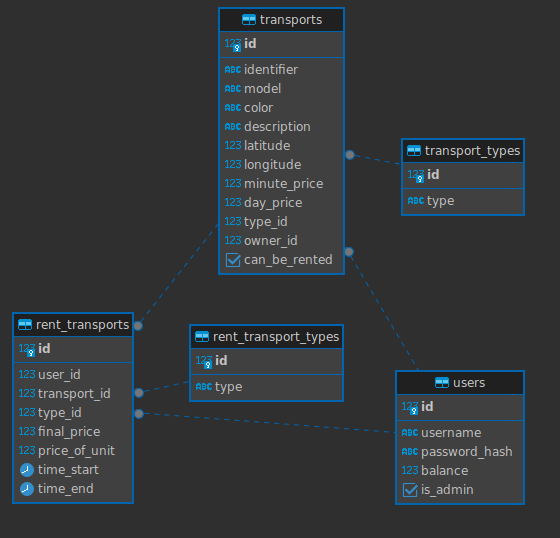

# Simbir.GO API

## Class diagram

## Run app
1. [Environments](#environments)
2. Run the [script](/src/main/resources/db/migration/V1__Init_DB.sql) for your database
3. ./gradlew build
4. java -jar build/libs/simbir_go-0.0.1-SNAPSHOT.jar

## Environments

To run this application you need to create `.env` file in root directory with next environments:

- `HOST` - host of Postgresql database
- `POSTGRES_USERNAME` - username for Postgresql database
- `POSTGRES_PASSWORD` - password for Postgresql database
- `POSTGRES_DATABASE` - name of Postgresql database
- `POSTGRES_SCHEMA` - name of Postgresql schema
