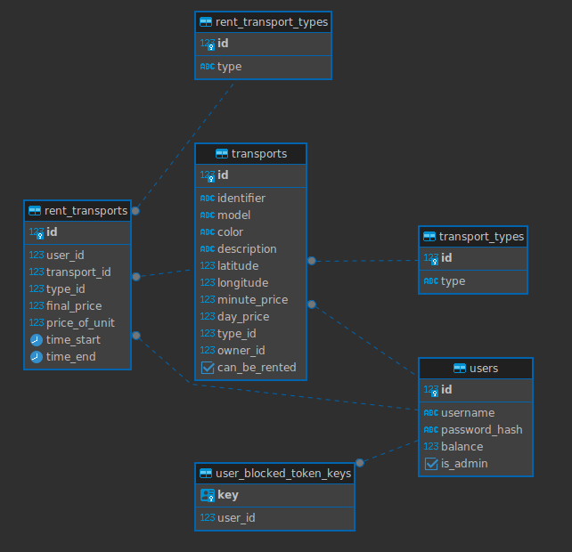

# Simbir.GO API

You can access Swagger and see all available endpoints by visiting http://localhost:8080/swagger-ui/index.html

## Class diagram



## Run app
1. Change [application.yaml](/src/main/resources/application.yaml)
2. Run the [script](/src/main/resources/db/migration/V1__Init_DB.sql) for your database
3. Create jar file with the command ```./gradlew build```
4. Run file ```java -jar build/libs/simbir_go-0.0.1-SNAPSHOT.jar```
